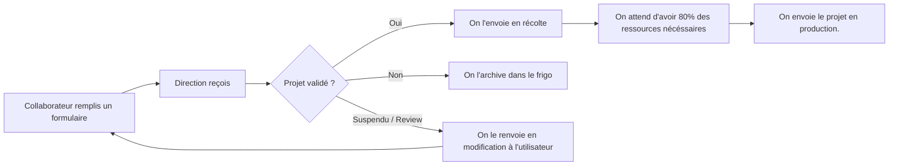
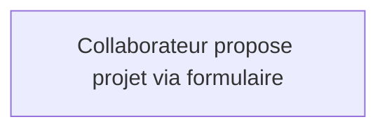

# Schémas

Ce document va repertorier les schémas utile à la compréhension de la demande client. Il contien(dra) différent schéma de différent 'flow', ou autre. 

## User flow

La navigation d'un projet proposé par un collaborateur selon client.

## Project request flow

