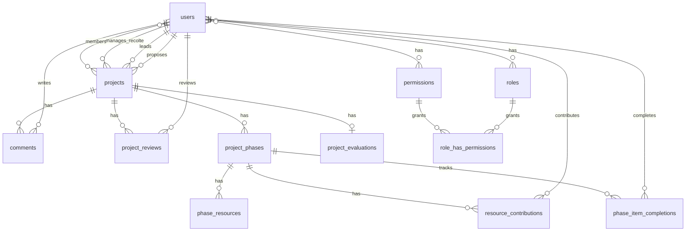

# Database Schema Documentation

*Last updated: 2026-07-08*

---

## Overview

The application uses **PostgreSQL** (via Laravel Sail) with **23 tables** total:
- 9 application tables
- 3 user/auth tables
- 5 Spatie Permission tables
- 6 Laravel infrastructure tables (cache, jobs, sessions)

---

## Entity Relationship Diagram



---

## Application Tables

### `projects`

Central table storing all project data throughout the lifecycle.

| Column | Type | Nullable | Notes |
|--------|------|----------|-------|
| `id` | `bigint` (PK) | NO | Auto-increment |
| `title` | `varchar(100)` | NO | Project title |
| `description` | `text` | NO | Problem + solution |
| `but` | `json` | NO | Goals/objectives (cast to array) |
| `perimetre` | `text` | YES | Project scope |
| `status` | `varchar(50)` | NO | Current state (cast to `ProjectState`) |
| `current_stage` | `varchar(50)` | NO | Lifecycle stage |
| `proposer_id` | `bigint` (FK) | NO | `users.id` — ON DELETE RESTRICT |
| `leader_id` | `bigint` (FK) | YES | `users.id` — ON DELETE SET NULL |
| `recolte_manager_id` | `bigint` (FK) | YES | `users.id` — ON DELETE SET NULL |
| `archived_at` | `timestamp` | YES | When archived |
| `restored_at` | `timestamp` | YES | When restored from archive |
| `last_reminder_at` | `timestamp` | YES | Email escalation tracking |
| `created_at` | `timestamp` | NO | `useCurrent()` |
| `updated_at` | `timestamp` | YES | |

**State Machine (stored in `status`):**
```
PropositionState → EvaluationState → RecolteState → EncoursState → CompleteState
       ↑                  ↓               ↓               ↓
  RevisionState      ArchiveState    ArchiveState    ArchiveState
       ↑                  ↓               ↓               ↓
  PropositionState    ArchiveState    ArchiveState    ArchiveState
```

| State | Stored Value |
|-------|--------------|
| `PropositionState` | `'proposition'` |
| `EvaluationState` | `'évaluation'` |
| `RevisionState` | `'révision'` |
| `RecolteState` | `'récolte'` |
| `EncoursState` | `'en cours'` |
| `CompleteState` | `'complété'` |
| `ArchiveState` | `'archivé'` |

---

### `project_phases`

Each project has one or more phases tracking objectives and deliverables.

| Column | Type | Nullable | Notes |
|--------|------|----------|-------|
| `id` | `bigint` (PK) | NO | Auto-increment |
| `project_id` | `bigint` (FK) | NO | `projects.id` — ON DELETE CASCADE |
| `name` | `text` | NO | Phase name |
| `duration` | `varchar(100)` | YES | Duration text |
| `description` | `text` | YES | Phase description |
| `objectifs` | `json` | YES | Array of objectives |
| `livrables` | `json` | YES | Array of deliverables |
| `order` | `integer` | NO | Default: 0; controls phase ordering |

**Note:** No timestamps (`$timestamps = false`).

---

### `phase_resources`

Resource requirements for each phase (budget, human resources, etc.).

| Column | Type | Nullable | Notes |
|--------|------|----------|-------|
| `id` | `bigint` (PK) | NO | Auto-increment |
| `phase_id` | `bigint` (FK) | NO | `project_phases.id` — ON DELETE CASCADE |
| `resource_type` | `varchar(100)` | NO | Type of resource |
| `description` | `text` | YES | Resource description |
| `work_rate` | `integer` | YES | Work rate/taux |
| `amount_needed` | `decimal(10,2)` | NO | Required amount |
| `amount_found` | `decimal(10,2)` | NO | Default: `0.00`; secured amount |

**Note:** No timestamps.

---

### `resource_contributions`

Individual contributions to phase resources (who contributed what).

| Column | Type | Nullable | Notes |
|--------|------|----------|-------|
| `id` | `bigint` (PK) | NO | Auto-increment |
| `phase_id` | `bigint` (FK) | NO | `project_phases.id` — ON DELETE CASCADE |
| `user_id` | `bigint` (FK) | NO | `users.id` — ON DELETE CASCADE |
| `resource_type` | `varchar(100)` | NO | Matches `phase_resources.resource_type` |
| `description` | `text` | YES | Contribution description |
| `amount` | `decimal(10,2)` | NO | Amount contributed |
| `created_at` | `timestamp` | YES | |
| `updated_at` | `timestamp` | YES | |

---

### `project_evaluations`

Impact evaluation scoring for projects (one per project).

| Column | Type | Nullable | Notes |
|--------|------|----------|-------|
| `id` | `bigint` (PK) | NO | Auto-increment |
| `project_id` | `bigint` (FK) | NO | `projects.id` — ON DELETE CASCADE |
| `portee` | `decimal(10,2)` | NO | Scope/reach score (0–50) |
| `impact` | `integer` | NO | Impact score (1–5) |
| `confiance` | `integer` | NO | Confidence score (0–100%) |
| `effort` | `integer` | NO | Effort score (1–5) |
| `importance` | `decimal(8,2)` | NO | **Generated column**: `(portee * impact * (confiance / 100.0)) / NULLIF(effort, 0)` |
| `created_at` | `timestamp` | YES | |
| `updated_at` | `timestamp` | YES | |

---

### `comments`

Historical comments on projects (cannot be edited or deleted after posting).

| Column | Type | Nullable | Notes |
|--------|------|----------|-------|
| `id` | `bigint` (PK) | NO | Auto-increment |
| `project_id` | `bigint` (FK) | NO | `projects.id` — ON DELETE CASCADE |
| `user_id` | `bigint` (FK) | NO | `users.id` — ON DELETE CASCADE |
| `content` | `text` | NO | Comment body |
| `stage` | `varchar(50)` | NO | Which stage the comment belongs to |
| `field_key` | `varchar(100)` | YES | Links to specific form field |
| `created_at` | `timestamp` | YES | |
| `updated_at` | `timestamp` | YES | |

---

### `project_reviews`

Direction review decisions on proposals.

| Column | Type | Nullable | Notes |
|--------|------|----------|-------|
| `id` | `bigint` (PK) | NO | Auto-increment |
| `project_id` | `bigint` (FK) | NO | `projects.id` — ON DELETE CASCADE |
| `user_id` | `bigint` (FK) | NO | `users.id` — ON DELETE CASCADE |
| `review_status` | `varchar(50)` | NO | Review decision |
| `created_at` | `timestamp` | YES | |
| `updated_at` | `timestamp` | YES | |

---

### `project_members` (Pivot)

Many-to-many relationship between projects and users (team members).

| Column | Type | Nullable | Notes |
|--------|------|----------|-------|
| `user_id` | `bigint` (FK) | NO | `users.id` — ON DELETE CASCADE |
| `project_id` | `bigint` (FK) | NO | `projects.id` — ON DELETE CASCADE |

**Primary Key:** Composite `(user_id, project_id)`
**No timestamps.**

---

### `phase_item_completions`

Tracks completion of individual objectives and deliverables within phases.

| Column | Type | Nullable | Notes |
|--------|------|----------|-------|
| `id` | `bigint` (PK) | NO | Auto-increment |
| `phase_id` | `bigint` (FK) | NO | `project_phases.id` — ON DELETE CASCADE |
| `item_type` | `varchar(20)` | NO | `'objectif'` or `'livrable'` |
| `item_index` | `unsigned integer` | NO | Index into JSON array |
| `completed` | `boolean` | NO | Default: `false` |
| `completed_by` | `bigint` (FK) | YES | `users.id` — ON DELETE SET NULL |
| `completed_at` | `timestamp` | YES | |
| `created_at` | `timestamp` | YES | |
| `updated_at` | `timestamp` | YES | |

**Unique Constraint:** `(phase_id, item_type, item_index)`

---

## User & Auth Tables

### `users`

| Column | Type | Nullable | Notes |
|--------|------|----------|-------|
| `id` | `bigint` (PK) | NO | Auto-increment |
| `name` | `varchar(255)` | NO | |
| `email` | `varchar(255)` | NO | UNIQUE |
| `email_verified_at` | `timestamp` | YES | |
| `password` | `varchar(255)` | NO | Hashed |
| `remember_token` | `varchar(100)` | YES | |
| `created_at` | `timestamp` | YES | |
| `updated_at` | `timestamp` | YES | |

**Note:** Roles are managed via Spatie Permission (`model_has_roles` pivot), not on the `users` table directly.

---

### `password_reset_tokens`

| Column | Type | Nullable | Notes |
|--------|------|----------|-------|
| `email` | `varchar(255)` | PK | |
| `token` | `varchar(255)` | NO | |
| `created_at` | `timestamp` | YES | |

---

### `sessions`

| Column | Type | Nullable | Notes |
|--------|------|----------|-------|
| `id` | `varchar(255)` | PK | String-based session ID |
| `user_id` | `bigint` (FK) | YES | `users.id` — indexed |
| `ip_address` | `varchar(45)` | YES | IPv6-capable |
| `user_agent` | `text` | YES | |
| `payload` | `longText` | NO | |
| `last_activity` | `integer` | NO | Indexed |

---

## Spatie Permission Tables

### `permissions`

| Column | Type | Nullable | Notes |
|--------|------|----------|-------|
| `id` | `bigint` (PK) | NO | Auto-increment |
| `name` | `varchar(255)` | NO | |
| `guard_name` | `varchar(255)` | NO | |
| `created_at` | `timestamp` | YES | |
| `updated_at` | `timestamp` | YES | |

**Unique:** `(name, guard_name)`

---

### `roles`

| Column | Type | Nullable | Notes |
|--------|------|----------|-------|
| `id` | `bigint` (PK) | NO | Auto-increment |
| `name` | `varchar(255)` | NO | |
| `guard_name` | `varchar(255)` | NO | |
| `created_at` | `timestamp` | YES | |
| `updated_at` | `timestamp` | YES | |

**Unique:** `(name, guard_name)`

**Defined Roles:**

| Role | Description |
|------|-------------|
| `admin` | Full access; only role that can assign/change roles |
| `direction` | Approve/refuse/suspend proposals; comment in Direction module |
| `chef_de_projet` | Comment on En cours projects; launch projects; mark complete |
| `project_manager` | Send to direction; archive projects |
| `recolte_manager` | Add/update resources on Récolte projects; assign team |
| `collaborateur` | Propose projects; edit own proposals |

---

### `model_has_roles` (Pivot: polymorphic)

| Column | Type | Nullable | Notes |
|--------|------|----------|-------|
| `role_id` | `bigint` (FK) | NO | `roles.id` — ON DELETE CASCADE |
| `model_type` | `varchar(255)` | NO | Polymorphic type |
| `model_id` | `bigint` | NO | Polymorphic ID |

**PK:** `(role_id, model_id, model_type)`

---

### `model_has_permissions` (Pivot: polymorphic)

| Column | Type | Nullable | Notes |
|--------|------|----------|-------|
| `permission_id` | `bigint` (FK) | NO | `permissions.id` — ON DELETE CASCADE |
| `model_type` | `varchar(255)` | NO | Polymorphic type |
| `model_id` | `bigint` | NO | Polymorphic ID |

**PK:** `(permission_id, model_id, model_type)`

---

### `role_has_permissions` (Pivot)

| Column | Type | Nullable | Notes |
|--------|------|----------|-------|
| `permission_id` | `bigint` (FK) | NO | `permissions.id` — ON DELETE CASCADE |
| `role_id` | `bigint` (FK) | NO | `roles.id` — ON DELETE CASCADE |

**PK:** `(permission_id, role_id)`

---

## Laravel Infrastructure Tables

### `cache`

| Column | Type | Nullable | Notes |
|--------|------|----------|-------|
| `key` | `varchar(255)` | PK | |
| `value` | `mediumText` | NO | |
| `expiration` | `bigint` | NO | Indexed |

### `cache_locks`

| Column | Type | Nullable | Notes |
|--------|------|----------|-------|
| `key` | `varchar(255)` | PK | |
| `owner` | `varchar(255)` | NO | |
| `expiration` | `bigint` | NO | Indexed |

### `jobs`

| Column | Type | Nullable | Notes |
|--------|------|----------|-------|
| `id` | `bigint` (PK) | NO | Auto-increment |
| `queue` | `varchar(255)` | NO | Indexed |
| `payload` | `longText` | NO | |
| `attempts` | `unsignedSmallInt` | NO | |
| `reserved_at` | `unsignedInt` | YES | |
| `available_at` | `unsignedInt` | NO | |
| `created_at` | `unsignedInt` | NO | |

### `job_batches`

| Column | Type | Nullable | Notes |
|--------|------|----------|-------|
| `id` | `varchar(255)` | PK | |
| `name` | `varchar(255)` | NO | |
| `total_jobs` | `integer` | NO | |
| `pending_jobs` | `integer` | NO | |
| `failed_jobs` | `integer` | NO | |
| `failed_job_ids` | `longText` | NO | |
| `options` | `mediumText` | YES | |
| `cancelled_at` | `integer` | YES | |
| `created_at` | `integer` | NO | |
| `finished_at` | `integer` | YES | |

### `failed_jobs`

| Column | Type | Nullable | Notes |
|--------|------|----------|-------|
| `id` | `bigint` (PK) | NO | Auto-increment |
| `uuid` | `varchar(255)` | NO | UNIQUE |
| `connection` | `varchar(255)` | NO | |
| `queue` | `varchar(255)` | NO | |
| `payload` | `longText` | NO | |
| `exception` | `longText` | NO | |
| `failed_at` | `timestamp` | NO | `useCurrent()` |

**Index:** `(connection, queue, failed_at)`

---

## Foreign Key Summary

| Table | FK Column | References | On Delete |
|-------|-----------|------------|-----------|
| `projects` | `proposer_id` | `users.id` | RESTRICT |
| `projects` | `leader_id` | `users.id` | SET NULL |
| `projects` | `recolte_manager_id` | `users.id` | SET NULL |
| `comments` | `user_id` | `users.id` | CASCADE |
| `comments` | `project_id` | `projects.id` | CASCADE |
| `project_phases` | `project_id` | `projects.id` | CASCADE |
| `phase_resources` | `phase_id` | `project_phases.id` | CASCADE |
| `resource_contributions` | `phase_id` | `project_phases.id` | CASCADE |
| `resource_contributions` | `user_id` | `users.id` | CASCADE |
| `project_members` | `user_id` | `users.id` | CASCADE |
| `project_members` | `project_id` | `projects.id` | CASCADE |
| `project_evaluations` | `project_id` | `projects.id` | CASCADE |
| `project_reviews` | `project_id` | `projects.id` | CASCADE |
| `project_reviews` | `user_id` | `users.id` | CASCADE |
| `phase_item_completions` | `phase_id` | `project_phases.id` | CASCADE |
| `phase_item_completions` | `completed_by` | `users.id` | SET NULL |

---

## Indexes

| Table | Column(s) | Type |
|-------|-----------|------|
| `users` | `email` | UNIQUE |
| `sessions` | `user_id` | INDEX |
| `sessions` | `last_activity` | INDEX |
| `cache` | `expiration` | INDEX |
| `cache_locks` | `expiration` | INDEX |
| `jobs` | `queue` | INDEX |
| `failed_jobs` | `uuid` | UNIQUE |
| `failed_jobs` | `(connection, queue, failed_at)` | COMPOSITE |
| `phase_item_completions` | `(phase_id, item_type, item_index)` | UNIQUE COMPOSITE |
| `model_has_permissions` | `(model_id, model_type)` | INDEX |
| `model_has_roles` | `(model_id, model_type)` | INDEX |
| `permissions` | `(name, guard_name)` | UNIQUE COMPOSITE |
| `roles` | `(name, guard_name)` | UNIQUE COMPOSITE |

---

## JSON Columns

| Table | Column | Content |
|-------|--------|---------|
| `projects` | `but` | Project goals/objectives |
| `project_phases` | `objectifs` | Array of phase objectives |
| `project_phases` | `livrables` | Array of phase deliverables |

---

## Generated Columns

| Table | Column | Formula |
|-------|--------|---------|
| `project_evaluations` | `importance` | `(portee * impact * (confiance / 100.0)) / NULLIF(effort, 0)` |

---

## Key Business Rules in Schema

1. **Project lifecycle** — `projects.status` enforces state machine transitions via Spatie Model States
2. **80% funding threshold** — Computed from `phase_resources.amount_found / amount_needed` aggregation
3. **Importance scoring** — Auto-calculated in `project_evaluations.importance` generated column
4. **Phase item tracking** — Individual objectives/deliverables tracked via `phase_item_completions`
5. **Resource contributions** — Per-user contributions tracked separately from aggregated `amount_found`
6. **Age-based reminders** — `projects.last_reminder_at` drives email escalation system
7. **Archive/restore cycle** — `archived_at` and `restored_at` timestamps track archive history
8. **Revision loop** — State machine allows `EvaluationState → RevisionState → PropositionState`
