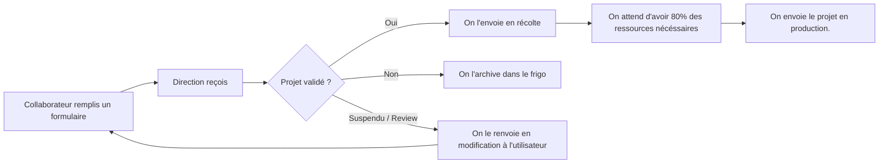

# Schémas

Ce document va repertorier les schémas utile à la compréhension de la demande client. Il contien(dra) différent schéma de différent 'flow', ou autre. 

## Project request flow

La navigation d'un projet proposé par un collaborateur selon client.

## Users flow
**Tout le monde peut tout voir ! Et tout le monde peut modifier sa propre proposition au moment de la proposition**

### Utilisateurs
Aucun droits spécifiques

### Direction 
**Valider** les projets

### Supports
Mettre à jour le status de récolte de ressources

### Chef de projets
**Ajouter des commentaires au projet auquel il est assigné**

### Admin
Gérer les rôles

### Liste d'états

* En proposition
* En validation
* En récolte
* En cours
* En archives
